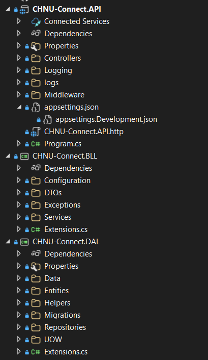

# 🎓 CHNU Connect

**Соціальна мережа Чернівецького національного університету ім. Ю. Федьковича.**

------------------------------------------------------------------------

## 🚀 Проєкт **CHNU Connect**

**CHNU Connect** — це університетська соціальна мережа, що поєднує функціональність **Facebook** та **Telegram**, створена спеціально для екосистеми **Чернівецького національного університету**.

### 📌 Можливості платформи
Платформа дозволяє:

- 📰 Переглядати стрічку новин  
- ✍️ Створювати та читати пости  
- ❤️ Взаємодіяти через лайки й коментарі  
- 👥 Створювати та приєднуватися до груп і спільнот  
- 💬 Обмінюватися приватними повідомленнями  
- 📅 Переглядати та створювати події  
- 🛠️ Адмініструвати контент  
- 🔐 Авторизуватися через пошту **@chnu.edu.ua**  


------------------------------------------------------------------------

## ✨ MVP Функціонал

### 🔥 Must-have
- 🔐 **Реєстрація/логін через університетську пошту**  
- 👤 **Профіль користувача** (фото, факультет, курс, контактні дані)  
- 📰 **Стрічка новин** (пости, коментарі, лайки)  
- 👥 **Групи та спільноти**  
- 📅 **Події**  
- 💬 **Приватний чат**  
- 🛠 **Панель адміністратора**

### ⭐ Should-have
- 🔔 **Push-нотифікації**  
- 🏷 **Хештеги**  
- 📌 **Форум / дошка оголошень**  
- 📆 **Інтеграція з Google Calendar**

### 💎 Nice-to-have
- 🎥 **Відеочати**  
- 🧭 **Кар'єрний розділ**  
- 🏆 **Гейміфікація**  
- 🔗 **Інтеграція з Moodle**

------------------------------------------------------------------------

## 🎯 User Stories

-   Як студент, я хочу реєструватися через *@chnu.edu.ua*, щоб
    підтвердити приналежність до університету.
-   Як користувач, я хочу створювати пости з фото, щоб ділитися
    новинами.
-   Як викладач, я хочу створювати групи курсу та ділитися матеріалами.
-   Як адміністратор, я хочу блокувати користувачів для підтримання
    порядку.

------------------------------------------------------------------------

## 🧱 Архітектура

Багатошарова архітектура (**Layered Architecture**):


✔ REST API\
✔ Swagger UI\
✔ JWT Authentication\
✔ Modular Services

------------------------------------------------------------------------

## 🛠 Стек технологій

### 🖥 Backend
- **.NET 8**
- **C#**
- **Entity Framework Core 8**
- **Mapster**
- **IdentityModel.Tokens.Jwt**
- **Npgsql.EntityFrameworkCore.PostgreSQL**
- **AutoMapper**
- **FluentValidation**
- **Swagger** (API документація)

### 🌐 Frontend
- **React 18**
- **Vite / Create React App**
- **Axios**
- **Tailwind CSS / Material UI**
- **Node v24.11.1**

### 🗄 Database
- **PostgreSQL (Neon)**
- **pgAdmin 4**

------------------------------------------------------------------------

## 📁 Структура репозиторію



------------------------------------------------------------------------

## 🧪 Запуск проєкту

### Backend (.NET)

``` bash
cd CHNU-Connect-API
dotnet restore
dotnet build
dotnet run
```

Swagger → http://localhost:5000/swagger

------------------------------------------------------------------------

### Frontend (React)

``` bash
cd client
npm install
npm run dev
```

------------------------------------------------------------------------

## 🗄 Підключення до БД

PostgreSQL (Neon Cloud):

    Host: <додамо>
    Database: chnu-connect-db
    User: <додамо>
    Password: <додамо>

------------------------------------------------------------------------

## 🔗 Посилання на артефакти

| Артефакт                    | Посилання                                                                 |
|-----------------------------|---------------------------------------------------------------------------|
| 📦 Репозиторій              | https://github.com/shillxzy/CHNU-Connect-app                              |
| 🎨 Figma                    | https://www.figma.com/design/FkKU48A7Jlwh0cU1fTRmeX/Wireframe             |
| 📁 Google Drive             | https://drive.google.com/drive/folders/13HNGzz9qcXsP1wbAETPmq3RobQUGMeSG |
| 📊 Органайзер документації | https://docs.google.com/spreadsheets/d/1h1JknJqW20tjLhGhkxINRSAiFgEEKy6nfvlBx_oIW64 |


------------------------------------------------------------------------

## 👥 Команда розробки

| Ім'я                                   | Роль                          |
|----------------------------------------|-------------------------------|
| Кушнір Станіслав Радіонович            | Project Manager              |
| Скальський Дмитро Романович            | Team Lead, Backend Developer |
| Дорошенко Олексій Олександрович         | Business Analyst, UX/UI      |
| Лютик Сергій Миколайович               | Backend Developer            |
| Дергач Максим В'ячеславович            | Backend Developer            |
| Зеленівський Микола Васильович         | Quality Assurance            |
| Ілюк Володимир Володимирович           | Front-end Developer          |
| Спелчук Габрієл Сергійович             | Front-end Developer          |
| Сапсай Ярослав Сергійович              | Business Analyst, UX/UI      |

------------------------------------------------------------------------

## 📌 Статус проєкту

⬜ Code Freeze\
⬜ Тестування завершено\
⬜ Підготовка до релізу\
⬜ Демо\
⬜ Реліз

------------------------------------------------------------------------

## © Ліцензія

*Буде додано пізніше (MIT / Apache 2.0)*
